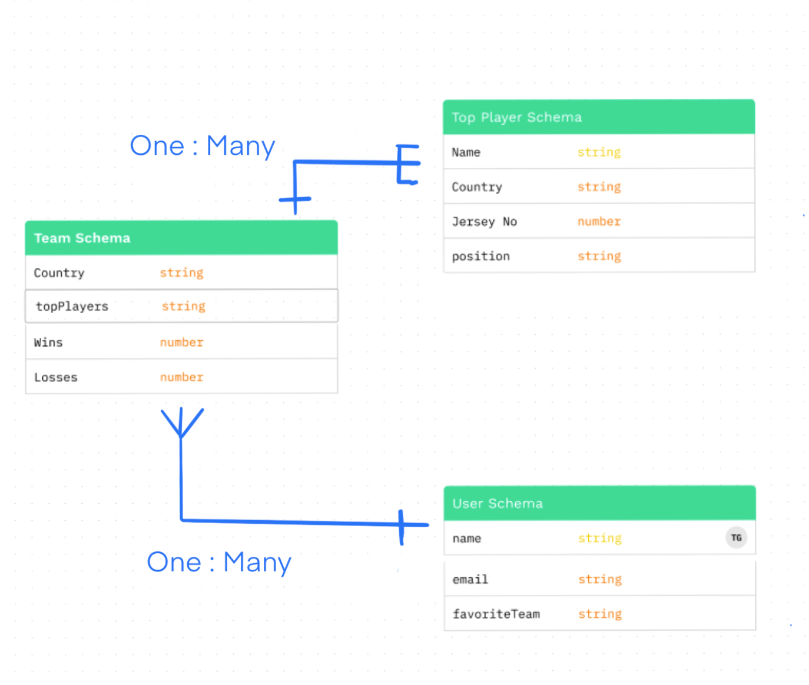

# Rugby 7s Tracker

## Background
With the interest I have for rugby, i have decided to create a tracker which allows me to track the different countries win/loss record and current Roster of players. 

### Trello Board
https://trello.com/b/YRf2KDwI/rugby-tracker

### ERD

### Wire Frame

### PseudoCode
Style: 
- Bootstrap with Colors

Data:
- 7s rugby teams (country)
- Team Captains (Name, Country, Jersey No, Position)
- Team win/loss 

Functionality:
  - Google Login
  - Click teams to bring up roster and and win/loss 
  - Click Top Players to find Country, Jersey No, and Position
  = allow user to select favorite team

### Technologies Used
  - OAuth
  - MongoDB
  - Mongoose
  - Express JS
  - Node JS
  - HTML5
  - CSS & Bootstrap
  - JavaScript

#### Images Used

https://media.istockphoto.com/id/1009616860/vector/rugby-sport-ball-icon-vector-line-3d-icon.jpg?s=612x612&w=0&k=20&c=1Mw9ytWww0iCWtUQ-8XAeWGc_Z2o2jfmwnxWsbAymno=
